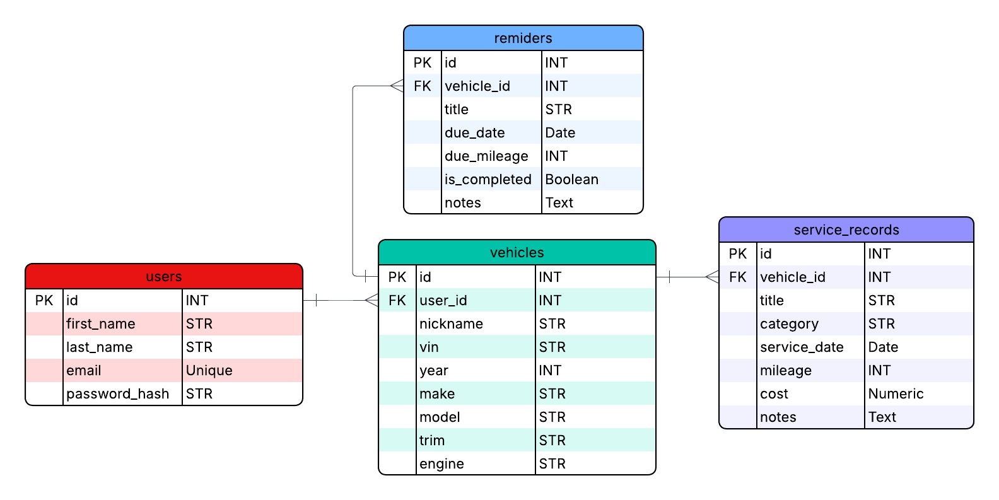

ServiceTrak is a full-stack vehicle maintenance tracking application built with React and Flask. It allows users to register, manage vehicles, decode VINs using the NHTSA API, and track service history and maintenance reminders.

## Features

- User authentication (register, login, logout)
- Vehicles CRUD (Create, Read, Update, Delete)
- VIN decoding via NHTSA (3rd-party API integration)
- Service Records CRUD (maintenance / repair history)
- Reminders CRUD (due date or due mileage + completion toggle)
- Clean, user-friendly UI with protected routes

## Tech Stack

**Frontend:** React (Vite), React Router  
**Backend:** Flask, Flask-JWT-Extended, Flask-SQLAlchemy  
**Database:** SQLite  
**3rd-Party API:** NHTSA VIN Decoder

## ERD



## Getting Started

### 1) Backend Setup

From the backend folder:

```bash
cd backend
python -m venv venv
# Windows:
venv\Scripts\activate
# Mac/Linux:
source venv/bin/activate

pip install -r requirements.txt
python run.py
```
### 2) Frontend Setup

From the frontend folder:

```bash
cd frontend
npm install
npm run dev
```
Make sure the backend is running before starting the frontend.

Backend runs at:
http://127.0.0.1:5000

Frontend runs at:
http://127.0.0.1:5173