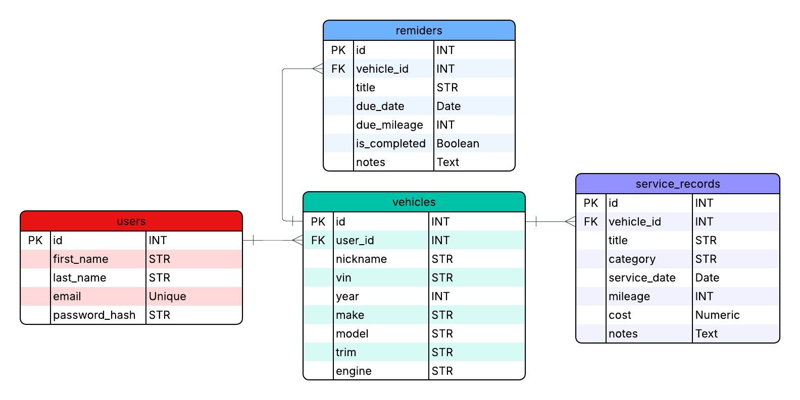

# ServiceTrak

ServiceTrak is a full-stack vehicle maintenance management platform that helps users track service history, maintenance reminders, recall information, and repair documentation. It combines a React frontend, Flask REST API, relational data model, authenticated user workflows, third-party vehicle data integrations, cloud file storage, CI checks, and production deployment practices.

## Why ServiceTrak?

Vehicle maintenance information is often scattered across paper receipts, emails, spreadsheets, and memory. That makes it harder to know what work has already been done, what maintenance is coming due, and where important repair documentation lives.

ServiceTrak centralizes vehicle information, service history, maintenance reminders, recall tracking, and repair documentation in one application. The goal is to help users keep maintenance records organized, searchable, and accessible when they need them.

## Live Demo

- Frontend: `https://service-trak.vercel.app`
- Backend API: `https://servicetrak-api.onrender.com`

Screenshot placeholders:

- Dashboard screenshot
- Vehicle detail screenshot
- Service records screenshot
- Reminder workflow screenshot

## Key Features

- User registration and login with JWT-protected API routes
- Protected React routes for authenticated users
- Vehicle CRUD with VIN storage and decoded vehicle details
- VIN decoding through the NHTSA VIN API
- Recall lookup and cached recall summary fields
- Service record CRUD for maintenance and repair history
- Reminder CRUD for date-based and mileage-based maintenance tasks
- Service record attachments using Cloudinary
- Dashboard summaries for vehicles, reminders, service records, and recalls
- GitHub Actions CI for backend tests and frontend checks

## Project Inspiration

ServiceTrak was inspired by more than a decade of experience working in transport refrigeration and vehicle maintenance environments. In those settings, accurate service history, maintenance schedules, diagnostics, and documentation are critical for keeping equipment reliable and work traceable.

This project was created to connect those real-world maintenance workflows with modern full-stack software development practices.

## What I Built

- Authentication and authorization: JWT login/register flow, protected frontend routes, and backend route protection.
- REST API development: Flask API endpoints for vehicles, reminders, service records, recalls, profile updates, and attachments.
- Database design and migrations: relational SQLAlchemy models with Flask-Migrate / Alembic database versioning.
- Third-party API integrations: NHTSA VIN decoding and recall lookup workflows.
- Cloud file storage: Cloudinary-backed service record attachments with stored metadata.
- CI/CD workflows: GitHub Actions checks for backend tests and frontend validation.
- Production deployment: split frontend/backend deployment using Vercel and Render with documented environment configuration.

## Tech Stack

**Frontend**

- React
- Vite
- React Router
- CSS modules/global app styling

**Backend**

- Flask
- Flask-JWT-Extended
- Flask-SQLAlchemy
- Flask-Migrate / Alembic
- Flask-CORS

**Database and Services**

- SQLite for local development
- PostgreSQL-compatible `DATABASE_URL` for production
- NHTSA VIN Decoder API
- NHTSA Recalls API
- Cloudinary for uploaded attachments
- Vercel frontend deployment
- Render backend deployment

## Architecture Overview

ServiceTrak is split into a Vite React frontend and a Flask REST API.

- The frontend handles routing, authenticated views, dashboard summaries, form interactions, and API requests.
- The backend owns authentication, authorization checks, database persistence, VIN decoding, recall lookup, and attachment metadata.
- User-owned resources are scoped through authenticated JWT identity checks.
- Vehicles are the parent resource for service records and reminders.
- Service record attachments are uploaded to Cloudinary, while attachment metadata is stored in the database.

## Engineering Highlights

- User ownership validation and authorization checks prevent users from accessing vehicles, service records, reminders, or attachments that do not belong to them.
- Relational database design models users, vehicles, service records, reminders, and service record attachments with clear parent-child relationships.
- Flask-Migrate database versioning supports controlled schema changes instead of relying on ad hoc table creation.
- GitHub Actions CI validates backend tests and frontend build quality before changes are merged.
- Render + Vercel deployment workflow separates the Flask API from the React frontend while documenting the required production environment variables.
- Cloudinary attachment management stores uploaded repair documentation externally while preserving file metadata in the application database.
- Dashboard summaries reuse existing API data, keeping the first version simple while avoiding premature backend aggregation endpoints.

## Lessons Learned

- Migration discipline matters: production databases need explicit, repeatable schema changes through migrations.
- Environment configuration management is part of the application: CORS origins, secrets, database URLs, and API base URLs must be documented and verified per environment.
- Secure authorization patterns require both authentication and ownership checks, especially when records are nested under user-owned resources.
- CI/CD validation catches syntax, test, lint, and build failures before deployment.
- Frontend/backend deployment separation improves flexibility, but it also requires careful coordination between Vercel environment variables and Render CORS settings.

## Local Setup

### Prerequisites

- Python 3.13 or compatible Python 3 version
- Node.js 22 or compatible Node version
- npm

### Backend Setup

From the repository root:

```bash
cd backend
python -m venv venv
```

Activate the virtual environment:

```bash
# Windows
venv\Scripts\activate

# macOS/Linux
source venv/bin/activate
```

Install dependencies:

```bash
pip install -r requirements.txt
```

Create a local environment file:

```bash
copy .env.example .env
```

On macOS/Linux:

```bash
cp .env.example .env
```

Run migrations:

```bash
flask db upgrade
```

Start the backend:

```bash
python run.py
```

The backend runs at:

```text
http://127.0.0.1:5000
```

### Frontend Setup

From the repository root:

```bash
cd frontend
npm install
npm run dev
```

The frontend runs at:

```text
http://127.0.0.1:5173
```

For local development, make sure the frontend API base URL points to the local backend:

```env
VITE_API_BASE_URL=http://127.0.0.1:5000
```

## Test and CI Commands

Backend tests:

```bash
cd backend
python -m pytest
```

Frontend lint:

```bash
cd frontend
npm run lint --if-present
```

Frontend production build:

```bash
cd frontend
npm run build
```

GitHub Actions runs the backend test suite and frontend checks on pull requests and pushes to `main`.

## Deployment

Deployment instructions are documented in [DEPLOYMENT.md](./DEPLOYMENT.md).

Production deployment uses:

- Render for the Flask backend
- Vercel for the Vite React frontend
- Environment variables for secrets, database URL, CORS origins, Cloudinary credentials, and frontend API URL

## Roadmap

- Add current vehicle mileage tracking for mileage-based overdue reminders
- Add email or notification reminders for upcoming maintenance
- Add CSV/PDF export for service history
- Add richer dashboard analytics and filtering
- Expand backend tests around recall lookup, attachments, and profile updates
- Add refresh-token or httpOnly cookie based auth
- Add an OBD-II diagnostic code lookup library
- Improve attachment management with rename/delete UX and preview polish
- Add more production observability and deployment health checks

## ERD


